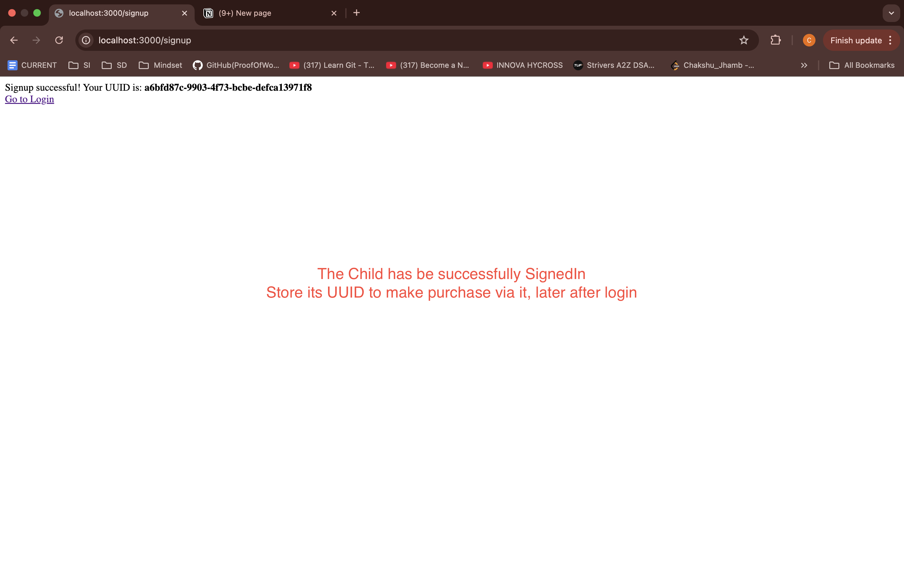

# 🔗 Multi-Level Referral and Earning System with Live Data Updates

This project implements a referral-based profit-sharing system where users can refer others and earn commissions from their direct and indirect referrals. It uses Node.js, Express, PostgreSQL, EJS for templating, and WebSockets for real-time updates. The system is fully containerized with Docker for consistent local deployment.

---

## 🖥️ Feature Walkthrough


---


---


---



---


---


---


---


---


---

### 🔹 Real-Time Earnings Update
Parent and grandparent see updates immediately without refreshing.


## 📌 Features

- **Multi-level Referral System** with up to **8 direct referrals per user**
- **Real-time profit distribution**:
  - 5% from direct (Level 1) referrals
  - 1% from indirect (Level 2) referrals
- **Earnings only apply** for purchases exceeding ₹1000
- **Live updates** via WebSocket (no page refresh required)
- View:
  - **Referral hierarchy-based earnings**
  - **Breakdown of direct and indirect income**
- Clean UI via EJS
- Full containerization using Docker + PostgreSQL

---

## 🏗️ System Architecture Overview

### Profit Distribution Logic:

- **Level 1**: Parent user earns `5%` of their direct referral’s valid purchases.
- **Level 2**: Grandparent user earns `1%` from their direct referral's referral purchases.
- **Condition**: Only triggered if purchase amount > ₹1000.

### Data Flow:
1. User signs up → receives unique `UUID`.
2. Referrals use UUID to register → system checks parent’s referral cap.
3. Purchase triggers profit distribution:
   - Store purchase
   - Credit profit to parent & grandparent
   - Update in real-time using WebSocket

---

## 🗃️ Database Schema

### users

| Column       | Type    | Description                            |
|--------------|---------|----------------------------------------|
| id           | UUID    | Primary key (generated)                |
| name         | TEXT    | User name                              |
| referrer_id  | UUID    | FK → `users(id)` (nullable)            |
| created_at   | TIMESTAMP | User creation timestamp              |

### purchases

| Column     | Type    | Description                          |
|------------|---------|--------------------------------------|
| id         | SERIAL  | Primary key                          |
| user_id    | UUID    | FK → `users(id)`                     |
| amount     | NUMERIC | Purchase amount                      |
| created_at | TIMESTAMP | Timestamp of the purchase         |

### earnings

| Column       | Type    | Description                              |
|--------------|---------|------------------------------------------|
| id           | SERIAL  | Primary key                              |
| user_id      | UUID    | Earner (FK → `users(id)`)                |
| from_user_id | UUID    | The purchaser who triggered the earning  |
| level        | INT     | 1 for direct, 2 for indirect              |
| amount       | NUMERIC | Earned amount                            |
| purchase_id  | INT     | FK → `purchases(id)`                     |
| created_at   | TIMESTAMP | Time of earning                        |

---

## 🚀 Getting Started (Local Development)

### 📦 Prerequisites

- Docker & Docker Compose
- Node.js (for development outside container)
- VS Code recommended

---

### 🛠️ Setup Instructions

1. **Clone the repo**  
   ```bash
   git clone https://github.com/yourusername/referral-system.git
   cd referral-system

2. **Create .env file**
    PORT=3000
    DB_USER=postgres
    DB_PASSWORD=postgres
    DB_NAME=referral_system
    DB_HOST=db
    DB_PORT=5432

3. **Start the System**
    docker-compose up --build

